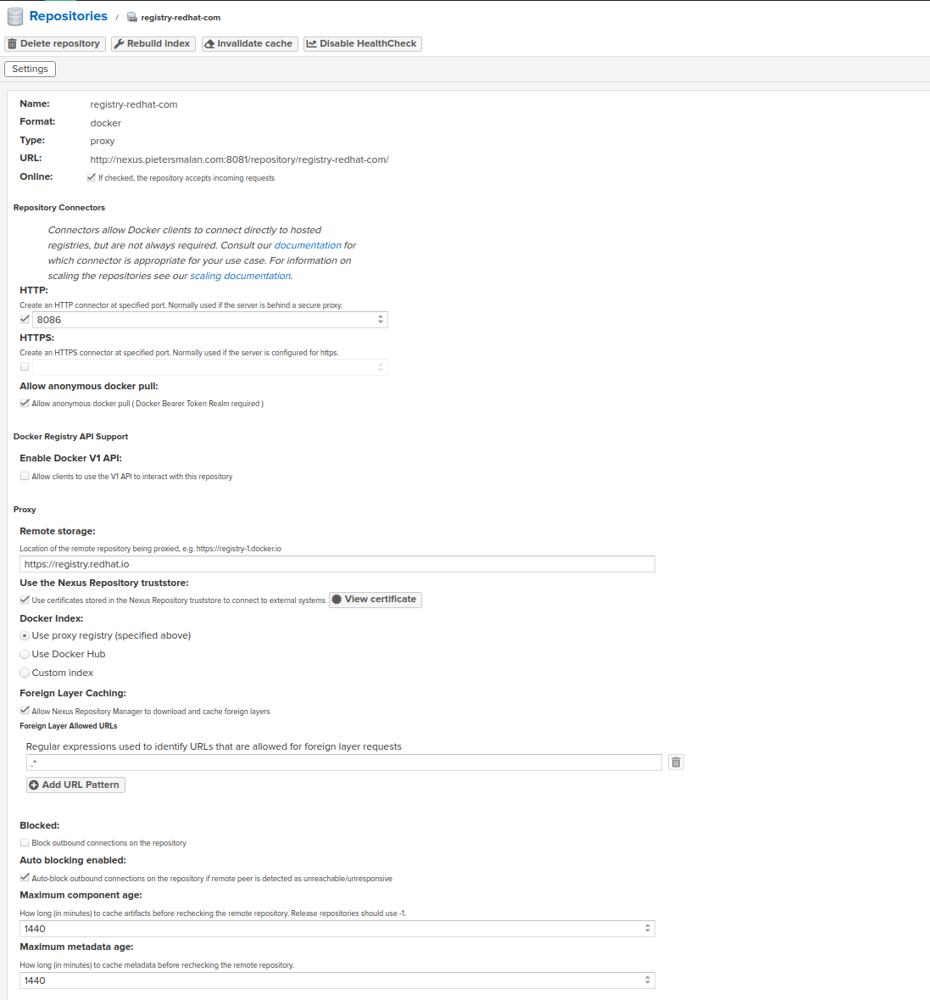
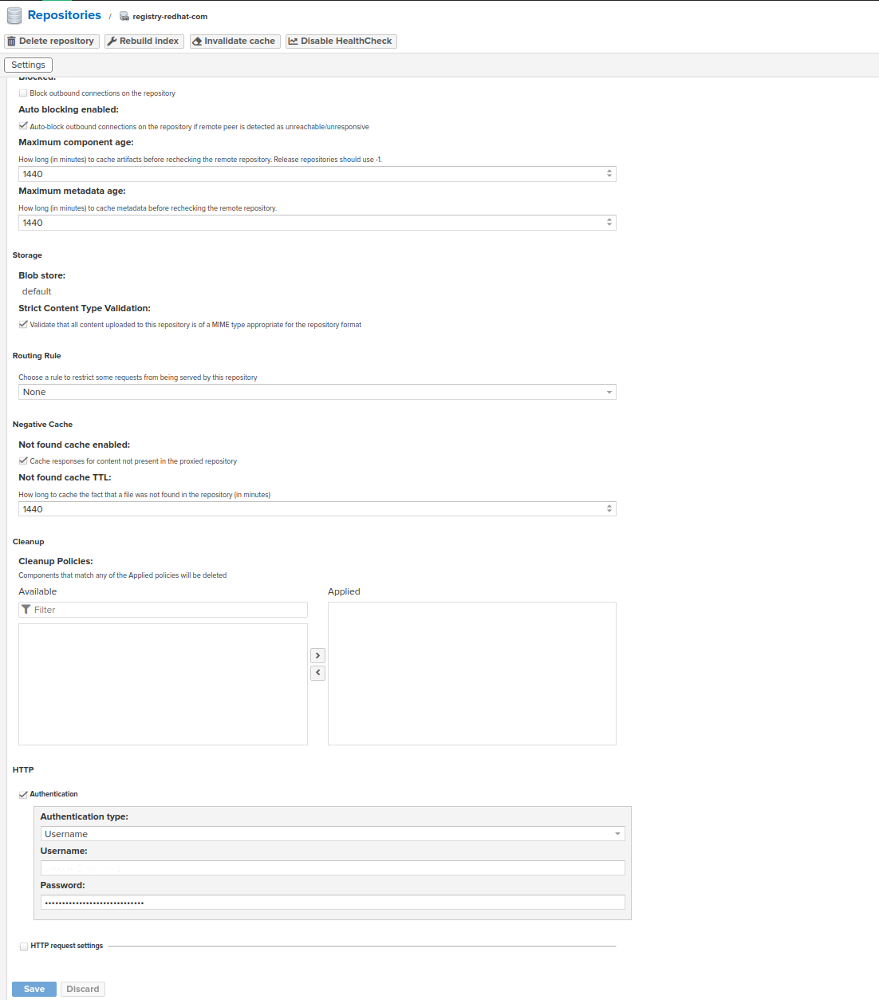
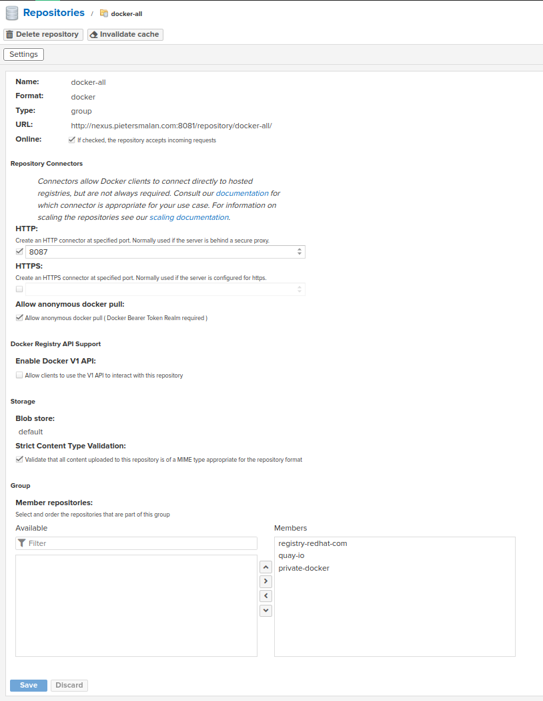

# Software requirements

1. Nexus 3 or higher
2. Openshift 4.12 and higher

# Nexus Configuration

### Create a "docker (proxy)" repository and supply the details as follow:

[TIP]
====
The username and password can be obtained from https://access.redhat.com/terms-based-registry/
====

### Create a docker registry to host your docker proxy

Add the new proxy registry in the Group Member Repositories

