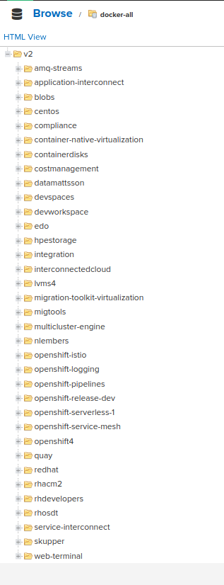

# Software requirements

1. Nexus 3 or higher
2. Openshift 4.12 and higher
3. NGINX 

# Nexus Configuration

### Create a "docker (proxy)" repository and supply the details as follow:

image::nexus2.png[]

image::nexus1.png[]

[TIP]
====
The username and password can be obtained from https://access.redhat.com/terms-based-registry/
====

Repeat this step for each individual repository you want to setup. In this example, I have user quay.io and registry.redhat.com.

### Create a docker registry to host your docker proxy

Add the new proxy registry in the Group Member Repositories

image::nexus3.png[]

# NGINX

I am using NGINX to enable HTTPS, instead of going through the pain of configuring NEXUS HTTPS.

[code]
----
user nginx;
worker_processes 1;

error_log /var/log/nginx/error.log warn;
pid /var/run/nginx.pid;

events {
worker_connections 1024;
}

http {

proxy_send_timeout 120;
proxy_read_timeout 300;
proxy_buffering off;
keepalive_timeout 5 5;
tcp_nodelay on;

server {
  listen *:443;

  ssl_certificate /etc/ssl/certs/cert.crt;
  ssl_certificate_key /etc/ssl/certs/cert.key;

  # allow large uploads of files
  client_max_body_size 1G;
  ssl on;

  # optimize downloading files larger than 1G
  #proxy_max_temp_file_size 2G;

  location / {
      # !! 10.1.175 is the ip of your nexus host and the port is the docker group  
      proxy_pass http://10.0.1.175:8081/;
      proxy_set_header Host $host;
      proxy_set_header X-Real-IP $remote_addr;
      proxy_set_header X-Forwarded-Host $host:$server_port;
      proxy_set_header X-Forwarded-Server $host;
      proxy_set_header X-Forwarded-For $proxy_add_x_forwarded_for;
      proxy_set_header X-Forwarded-Proto "https";
  }
}

----

# Openshift 

Create image mirror sets for tags and digests:

.ImageDigestMirrorSet.yaml
[code]
----
apiVersion: config.openshift.io/v1
kind: ImageDigestMirrorSet
metadata:
  name: nexus-digest-mirror
spec:
  imageDigestMirrors:
    - source: quay.io
      mirrors:
        - nexus.pietersmalan.com
      mirrorSourcePolicy: AllowContactingSource
    - source: registry.redhat.com
      mirrors:
        - nexus.pietersmalan.com
      mirrorSourcePolicy: AllowContactingSource

----

.ImageTagsMirrorSet.yaml
[code]
----
apiVersion: config.openshift.io/v1
kind: ImageTagMirrorSet
metadata:
  name: nexus-tag-mirror
spec:
  imageTagMirrors:
    - source: quay.io
      mirrors:
        - nexus.pietersmalan.com
      mirrorSourcePolicy: AllowContactingSource
    - source: registry.redhat.com
      mirrors:
        - nexus.pietersmalan.com
      mirrorSourcePolicy: AllowContactingSource

----

[WARNING]
====
Keep in mind that we are updating the kubelet configuration, so it will do a rolling update on the nodes, when you apply the mirror sets.
====

# Confirm configuration is working

Open the docker group repository in your Nexus repository web page, and you should see a bunch of images cached for the different repositories.

