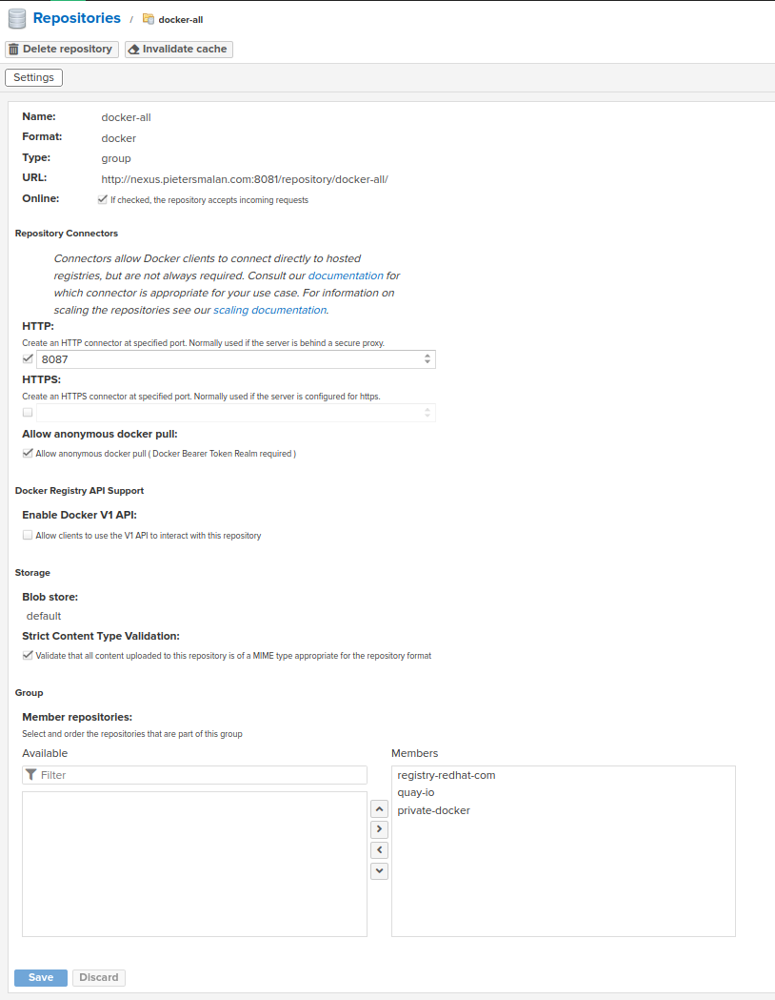

# Software requirements

1. Nexus 3 or higher
2. Openshift 4.12 and higher

# Nexus Configuration

1. Create a "docker (proxy)" repository and supply the details as follow:

image::nexus2.png[]

[TIP]
The username and password can be obtained from https://access.redhat.com/terms-based-registry/

